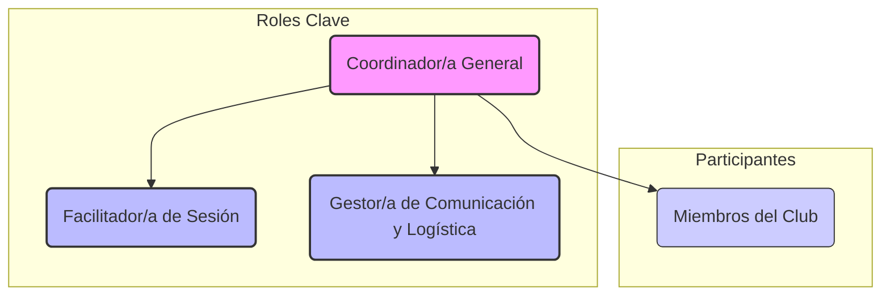

```mermaid
graph TD
    A(Coordinador/a General) --> B(Facilitador/a de Sesión);
    A --> C(Gestor/a de Comunicación y Logística);
    A --> D(Miembros del Club);

    subgraph "Roles Clave"
        A
        B
        C
    end

    subgraph "Participantes"
        D
    end

    style A fill:#f9f,stroke:#333,stroke-width:2px
    style B fill:#bbf,stroke:#333,stroke-width:2px
    style C fill:#bbf,stroke:#333,stroke-width:2px
    style D fill:#ccf,stroke:#333,stroke-width:1px
```